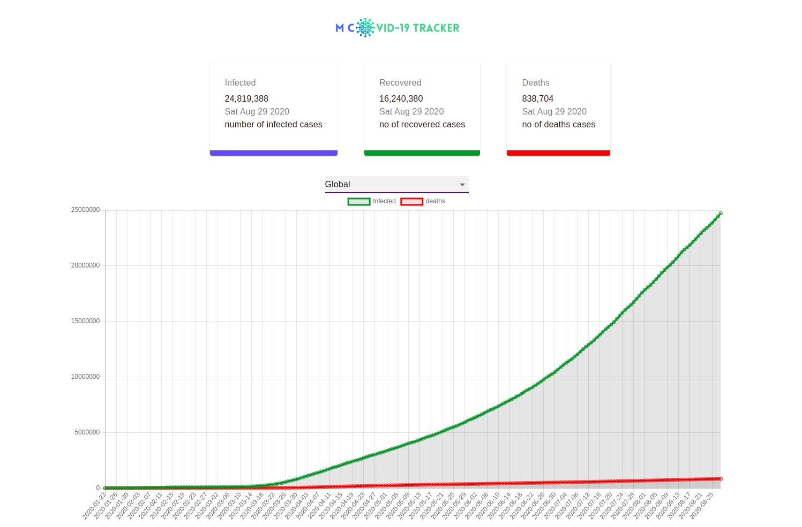

# M-COVID-19 TRACKER

## INTRODUCTION

A COVID-19 TRACKER APPLICATION BUILT USING
- React
- Charts.JS
- Material UI.

## API

API used: https://covid19.mathdro.id/api
Project link: https://reverent-boyd-dd6466.netlify.app

TO BRING THE APPLICATION TO LIFE
- run `npm install` and then `npm start`
